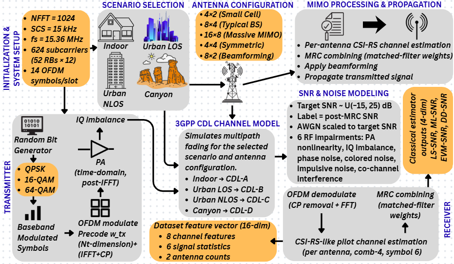

<h1 align="center">CEF-5GNR-SNR</h1>

<p align="center">
  A 100,000-sample synthetic dataset and reference implementation for SNR estimation
  in 5G NR channels, generated across four 3GPP TR 38.901 CDL propagation profiles with
  six stochastic RF impairments, MIMO beamforming, and classical pilot-based SNR
  estimator baselines.
</p>

<p align="center"><em>Companion dataset and code for the paper "CEF: Classical Estimator Fusion for 5G NR SNR Estimation Under RF Impairments."</em></p>

---

## Overview

This repository provides a standards-compliant, fully-labeled dataset together with the
MATLAB generator and Python training pipeline used in the paper:

- **3GPP CDL Channel Realizations:** Four propagation profiles (CDL-A/B/C/D) spanning
  indoor office, urban LOS, urban NLOS, and canyon environments.
- **MIMO and Beamforming:** Five antenna configurations (small cell, typical BS,
  massive MIMO, symmetric, beamforming-optimized) with random steering angles,
  per-antenna CSI-RS channel estimation, and maximum ratio combining at the receiver.
- **RF Impairment Models:** Doppler, PA nonlinearity, IQ imbalance, phase noise,
  colored noise, and co-channel interference, each injected stochastically at
  realistic deployment rates, on top of an AWGN floor.
- **Classical SNR Estimator Baselines:** LS, ML, EVM, and decision-directed (DD)
  estimators computed per sample from receiver-observable quantities.
- **CEF Model:** A five-layer multilayer perceptron that fuses the 16
  receiver-observable features with the four classical SNR estimates, together
  with baseline architectures and ablation studies.
- **MATLAB Generator and Python Training Pipeline:** Full source to regenerate
  the dataset and reproduce all paper results.

---

## System Architecture

<p align="center">
  
</p>
<p align="center"><em>Fig. 1: End-to-end dataset generation pipeline — scenario selection, 3GPP CDL channel realization, MIMO propagation, RF impairment injection, receiver processing, and feature extraction.</em></p>

| Stage | Description |
|---|---|
| Initialization & System Setup | NFFT = 1024, SCS = 15 kHz, f<sub>s</sub> = 15.36 MHz, 624 used subcarriers (52 RBs × 12), 14 OFDM symbols/slot |
| Scenario Selection | 4 environments — Indoor, Urban LOS, Urban NLOS, Canyon |
| 3GPP CDL Channel Model | Indoor → CDL-A, Urban LOS → CDL-B, Urban NLOS → CDL-C, Canyon → CDL-D |
| Antenna Configuration | 5 MIMO configs: 4×2, 8×4, 16×8, 4×4, 8×2 |
| Transmitter | Random bits → QPSK/16-QAM/64-QAM → precoding w<sub>tx</sub> → IFFT + CP → PA (time-domain, post-IFFT) → IQ imbalance |
| Channel Realization | 3GPP TR 38.901 CDL multipath fading with native Doppler, per the selected scenario and antenna configuration |
| SNR & Noise Modeling | Target SNR defined as post-MRC SNR, AWGN scaled to target, six stochastic RF impairments, 10% impulsive noise |
| Receiver | OFDM demodulate (CP removal + FFT) → comb-4 CSI-RS-like pilot channel estimation (per antenna, symbol 6) → delay-domain denoising → MRC combining |
| Feature Extraction | 16 receiver-observable features (8 channel + 6 signal + 2 config) |
| Classical Estimators | LS-SNR, ML-SNR, EVM-SNR, DD-SNR computed from the same received signal |

---

## Dataset Composition

The 100,000 samples are distributed across four CDL profiles with a common
target-SNR distribution of [−15, 25] dB for every profile.

| Profile | Delay Spread (ns) | SNR Range (dB) | Samples |
|---|---|---|---|
| CDL-A (Indoor Office) | 10–50 | −15 to 25 | 25,000 |
| CDL-B (Outdoor Urban LOS) | 50–150 | −15 to 25 | 20,000 |
| CDL-C (Outdoor Urban NLOS) | 100–300 | −15 to 25 | 35,000 |
| CDL-D (Outdoor Canyon) | 200–400 | −15 to 25 | 20,000 |

**Total: 100,000 samples** across 4 CDL profiles × 5 antenna configurations × 3 modulation schemes.

A separate **5,000-sample out-of-distribution (OOD) set** is provided with impairment
severity shifted beyond the training ranges (stronger PA compression and IQ imbalance,
larger phase-noise variance, more correlated colored noise, lower SIR).

---

## RF Impairment Models

| Impairment | Model | Injection Rate |
|---|---|---|
| Doppler | f<sub>D</sub> = v·f<sub>c</sub>/c (native to CDL object) | 100% |
| PA Nonlinearity | x<sub>PA</sub> = x / (1 + α·\|x\|²), α ~ U(0.05, 0.20) | 60% |
| IQ Imbalance | x<sub>IQ</sub> = α<sub>IQ</sub>·x + β<sub>IQ</sub>·x*, gain ∈ [0.3, 1.5] dB, phase ∈ [1°, 5°] | 50% |
| Phase Noise | Wiener process, 3° RMS drift per slot at −80 dBc/Hz | 80% |
| Colored Noise | n[k] = ρ·n[k−1] + √(1−ρ²)·w[k], ρ ~ U(0.3, 0.8) | 40% |
| Co-Channel Interference | BPSK interferer, SIR ~ U(5, 20) dB | 30% |

An additional impulsive noise component is injected with 10% probability, affecting
approximately 2% of symbols per affected slot, with impulse power uniformly drawn
between 5 and 15 times the noise floor.

> **Note:** Carrier Frequency Offset (CFO) is intentionally excluded. At normalized
> offset ε = 0.01–0.05, CFO dominates all classical estimators (ΔRMSE ≈ +30 dB),
> preventing meaningful baseline comparison. CFO compensation is assumed at the
> receiver prior to SNR estimation.

---

## Classical SNR Estimator Baselines

The four estimators below are computed from the same received signal and serve as
fusion inputs to the CEF model. All are receiver-observable — a practical 5G NR
receiver already computes them for link adaptation.

| Estimator | Basis |
|---|---|
| LS-SNR | Least-squares pilot channel estimate with delay-domain noise-floor estimate |
| ML-SNR | Maximum-likelihood pilot estimate (N-normalized variance) |
| EVM-SNR | Error Vector Magnitude after MRC combining |
| DD-SNR | Decision-directed estimator using symbol decisions |

---

## Feature Vector

Each sample carries 16 receiver-observable features. None are simulator
ground-truth quantities — all are derived from the receiver-side pilot channel
estimate and equalized symbols.

| # | Feature | Group |
|---|---|---|
| 1 | Estimated channel gain | Channel |
| 2 | K-factor (PDP-based) | Channel |
| 3 | K-factor (moment-based) | Channel |
| 4 | RMS delay spread (ns) | Channel |
| 5 | Coherence bandwidth (MHz) | Channel |
| 6 | Estimated number of paths | Channel |
| 7 | Maximum delay (ns) | Channel |
| 8 | Frequency-domain gain variability (dB) | Channel |
| 9 | Rx power | Signal |
| 10 | Rx power std | Signal |
| 11 | Rx phase mean | Signal |
| 12 | Equalized signal power | Signal |
| 13 | Equalized signal std | Signal |
| 14 | Kurtosis | Signal |
| 15 | Num. Tx antennas | Config |
| 16 | Num. Rx antennas | Config |

**Target label:** `SNR_dB` — the configured post-MRC SNR at the receiver, in dB.

Each row corresponds to one simulated transmission instance with its associated
feature vector and ground-truth SNR. The metadata CSV provides the four classical
estimator outputs, CDL profile, modulation scheme, Doppler shift, and impairment flags.

---

## Getting Started

### Installation

```bash
git clone https://github.com/Swandip7/CEF-5GNR-SNR.git
cd CEF-5GNR-SNR
